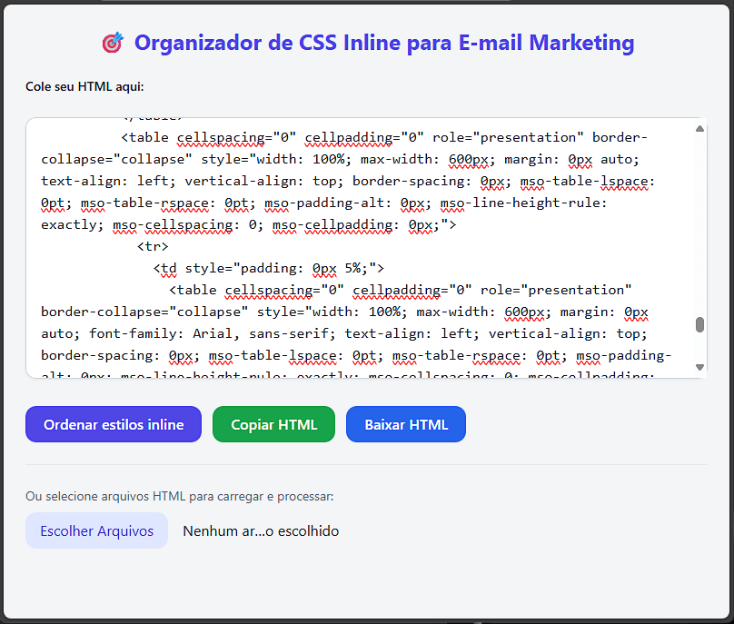

# 🔮 Inline CSS styles organizer

<figure>
    
    <figcaption>Uma captura de tela mostrando o projeto funcionando </figcaption>
</figure>

---

## ✨ Sobre o Projeto

O **Inline CSS styles organizer** é uma ferramenta web desenvolvida com HTML, CSS (via Tailwind CDN) e JavaScript puro, com a ajuda do ChatGPT, que permite reordenar as propriedades de estilos inline (`style=""`) dentro de elementos HTML. 

Ele foi pensado para desenvolvedores e designers que precisam manter consistência e organização em códigos HTML — especialmente útil em projetos de e-mail marketing ou landing pages com muito estilo inline.

Você pode:

- Colar HTML diretamente no campo de texto
- Processar múltiplos arquivos `.html`
- Reordenar automaticamente os estilos inline
- Fazer download dos arquivos organizados

---

## 💡 Como usar

### 1. Acesse a página
Abra o arquivo `index.html` no navegador.

### 2. Escolha uma forma de uso:
- **Colar HTML manualmente**: use o textarea principal e clique em `Ordenar estilos`
- **Selecionar múltiplos arquivos**: clique em `Selecionar arquivos`, e depois em `Ordenar e Baixar`

### 3. Resultado:
- Para HTML colado manualmente: aparece um pop-up informando que o texto foi reordenado
- Para arquivos: downloads automáticos são iniciados com os arquivos organizados

---

## ⚙️ Lógica do Código

### 📁 Estrutura

- `index.html` – Interface principal da ferramenta
- `script.js` – Contém toda a lógica de manipulação e reordenação
- Tailwind via CDN – Usado para estilização futurista/dark com tema de galáxia

### 🧠 Funções principais

#### `sortInlineStyles(styleString)`
- Recebe uma string de estilo como `color: red; font-size: 14px;`
- Divide as propriedades em um array, ordena alfabeticamente e retorna como string organizada

#### `reorderStylesInHTML(htmlText)`
- Recebe um HTML como string
- Usa RegEx para encontrar todos os `style="..."`, extrai os estilos, aplica o `sortInlineStyles` e substitui o valor antigo pelo novo

#### `handleTextareaSubmit()`
- Acionada ao clicar em "Ordenar estilos"
- Pega o valor do textarea, processa com `reorderStylesInHTML` e mostra um `alert` confirmando

#### `handleFileUpload(files)`
- Lê múltiplos arquivos usando `FileReader`
- Para cada arquivo:
  - Processa o conteúdo com `reorderStylesInHTML`
  - Cria um Blob e inicia o download com o novo conteúdo
  - 
---

## 🧬 Tecnologias Utilizadas

- [Tailwind CSS v4 via CDN](https://tailwindcss.com/)
- HTML5
- JavaScript Puro (sem dependências)
- ChatGPT

## 🚀 Futuras Melhorias

- Validação e aviso para HTML mal formatado
- Modo de visualização lado a lado (antes/depois)
- Suporte para mais atributos além de `style`
- <strong>Transformar em uma extensão para VS Code ou app desktop</strong>
